<div align="center">


# 🛰️ AI NEWS CURATOR

### `V3` — Autonomous Intelligence · Research Fallback · Multi-Platform Publishing

**DISCOVER · EVALUATE · ENRICH · PUBLISH**

*A self-driving n8n newsroom that finds, judges, writes, and ships AI/security news — with zero human in the loop.*

[](https://n8n.io)
[](https://ai.google.dev)
[](#)
[](#)
[](LICENSE)

**Built by [K1NG BRONXO](https://github.com/)**

</div>

---

```
   ┌────────────────────────────────────────────────────────┐
   │  9 RSS SOURCES → SCORE → AI EDITOR → ENRICH → PUBLISH   │
   │  Telegram  ×  LinkedIn  ×  Discord  ·  fully autonomous │
   └────────────────────────────────────────────────────────┘
```

## ⚡ What this is

This repo holds a self-operating **n8n** workflow that runs an entire AI/cybersecurity news desk on autopilot. Every 3 hours it scans nine major tech feeds, scores every article with a purpose-built relevance engine, hands the best candidate to a Gemini-powered "senior editor" for a worthiness verdict, enriches the story with sentiment/entity/credibility analysis, generates an A/B-tested headline, builds a publish-ready image, and ships the final post to **Telegram**, then auto-repurposes it into a polished **LinkedIn** post — with **Discord** and thread/newsletter spinoffs along the way.

If every RSS candidate gets rejected by the AI editor, V3 doesn't just give up — it falls back to **live research** against the Hacker News Algolia API and tries again.

Two versions live here:

| | **V1** — `ai-news-curator-v1.json` | **V3** — `ai-news-curator-v3.json` |
|---|---|---|
| Codename | `TELE-LINKEDIN` | `AI News Curator V3` |
| Nodes | 18 | 64 |
| Sources | 3 RSS feeds | 9 RSS feeds |
| Filtering | Static NLP taxonomy | Weighted scoring + AI worthiness gate |
| Rejections | Post anyway | Retry next candidate → live research fallback |
| Enrichment | None | Sentiment, entities, credibility, A/B headlines |
| Image pipeline | Basic | RSS image → Open Graph fallback → merge pipeline |
| Repurposing | None | X thread, Discord embed, newsletter blurb, poll |
| Priority handling | None | Breaking-news instant-publish flag |
| Analytics | None | In-workflow analytics collector |
| Platforms | Telegram → LinkedIn | Telegram → LinkedIn → Discord |

> **TL;DR:** V1 is a wire service. V3 is a newsroom.

---

## 🧠 How V3 thinks

```mermaid
flowchart TD
    A[⏰ Schedule Trigger<br/>every 3 hours] --> B[📡 Fetch 9 RSS Feeds<br/>HN · TechCrunch · THN · MIT Tech Review<br/>Ars Technica · VentureBeat · The Verge · OpenAI · Wired]
    B --> C[🔀 Merge Feeds]
    C --> D[🧮 Smart Filter: Score & Rank<br/>source weight + taxonomy match − clickbait]
    D --> E{Any article found?}
    E -- No --> R
    E -- Yes --> F[📦 Build Candidate Envelope]
    F --> G[🤖 AI Story Worthiness Gate<br/><i>Gemini · senior editor persona</i>]
    G --> H{Worth posting?}
    H -- No --> I[🔁 Fallback Router]
    I --> J{More candidates?}
    J -- Yes --> F
    J -- No --> R[🔬 Research Fallback<br/>live HN Algolia search]
    R --> S[🤖 AI Research Curator]
    S --> T{Story found?}
    T -- No --> X[❌ Log Research Failed]
    T -- Yes --> K
    H -- Yes --> K[✨ Content Enrichment Engine<br/>sentiment · entities · credibility · A/B headline]
    K --> L[🚨 Breaking Priority Flag]
    L --> M[🖼️ Image Pipeline<br/>RSS image → OG/Twitter meta fallback → merge]
    M --> N[✍️ Gemini Writer — Telegram]
    N --> O[📤 Telegram: Photo + Caption<br/><i>or text-only fallback</i>]
    O --> P[♻️ Repurpose Engine<br/>X thread · Discord embed · newsletter · poll]
    P --> Q1[💬 Discord Webhook]
    O --> Q2[⏱️ 10s Delay]
    Q2 --> Q3[🔎 Scrape Published Telegram Message]
    Q3 --> Q4[✍️ Gemini Writer — LinkedIn]
    Q4 --> Q5[🧾 Clean Text + Signature]
    Q5 --> Q6{Has photo?}
    Q6 -- Yes --> Q7[⬇️ Download Telegram Photo]
    Q7 --> Q8[📎 LinkedIn Post + Image]
    Q6 -- No --> Q9[📝 LinkedIn Post Text Only]
    K --> AN[📊 Analytics Collector]

    style G fill:#8E75FF,stroke:#fff,color:#fff
    style S fill:#8E75FF,stroke:#fff,color:#fff
    style N fill:#8E75FF,stroke:#fff,color:#fff
    style Q4 fill:#8E75FF,stroke:#fff,color:#fff
    style K fill:#8E75FF,stroke:#fff,color:#fff
    style P fill:#8E75FF,stroke:#fff,color:#fff
```



<details>
<summary><b>🔬 Why the research fallback matters (click to expand)</b></summary>

<br>

Most "auto-poster" workflows just publish whatever the RSS feed spits out first. V3 refuses to ship a weak story:

1. The **Smart Filter** ranks every article by source authority, taxonomy relevance, and freshness — then strips clickbait and sponsored content.
2. The top candidate goes to the **AI Story Worthiness Gate**, a Gemini call running a senior-editor persona that returns a structured verdict: `worthPosting`, `confidence`, `clickbaitRisk`, `factCheck`.
3. If rejected, the **Fallback Router** doesn't stop — it walks to the *next* ranked candidate from the same RSS batch.
4. If the entire RSS batch strikes out, V3 pivots to **live research**: it queries the Hacker News Algolia search API in real time for fresh AI/LLM/cybersecurity/agent signals, and asks the AI to pick the best one from scratch.
5. Only if that also comes up empty does the run log a `Research Failed` event and stand down until the next scheduled trigger.

This means the bot would rather skip a cycle than post something low-quality — while still trying its hardest not to skip.

</details>

<details>
<summary><b>🎯 The scoring taxonomy (click to expand)</b></summary>

<br>

Every article is scored against five weighted content domains before anything reaches the AI:

| Domain | Signal examples |
|---|---|
| `aiTools` | generative AI, agentic AI, ChatGPT, Gemini, Copilot, OpenAI, Anthropic, Claude |
| `aiHacks` | jailbreaks, prompt injection, ransomware, breaches, CVEs, deepfakes |
| `trendingAiSeo` | AI Overviews, GEO, semantic search, algorithm updates, SGE |
| `devNews` | vibe coding, dev tools, open source, frameworks, APIs, SDKs |
| `coreSecurity` | zero-trust, SOAR, pentesting, cyber attacks, vulnerabilities, encryption |

Source authority is separately weighted (OpenAI's own blog and Google's blog sit near the top; unlisted sources default to a neutral baseline), and a clickbait/sponsored-content regex bank actively *subtracts* score from phrases like "you won't believe" or "sponsored."

</details>

<details>
<summary><b>♻️ What "repurposing" actually generates (click to expand)</b></summary>

<br>

Once a story is live on Telegram, the **Repurpose Engine** asks Gemini to transform the exact same published copy into four different formats in one structured call:

- 🧵 A 3-tweet **X/Twitter thread**
- 💬 A **Discord embed** summary (under 500 characters, markdown-free)
- 📰 A **newsletter blurb** (2 sentences)
- ❓ A **poll question** for engagement

The LinkedIn post is generated separately — not just cross-posted — by re-reading the live Telegram message and rewriting it with LinkedIn-native tone, structure, and a brand signature.

</details>

---

## 🗂️ Repo structure

```
.
├── workflows/
│   ├── ai-news-curator-v3.json     ← import this one (recommended)
│   └── ai-news-curator-v1.json     ← legacy / reference build
├── docs/
│   ├── SETUP.md                    ← credentials & step-by-step install
│   └── CHANGELOG.md                ← full V1 → V3 diff
├── assets/
│   └── logo.png                    ← brand logo
├── LICENSE
└── README.md
```

---

## 🚀 Quickstart

```bash
# 1. Clone
git clone https://github.com/<your-username>/ai-news-curator.git
cd ai-news-curator

# 2. In n8n: Workflows → Import from File
#    → select workflows/ai-news-curator-v3.json

# 3. Wire up credentials (see docs/SETUP.md)
#    - Google Gemini (PaLM) API
#    - Telegram Bot API (x2 bots: publisher + LinkedIn listener)
#    - LinkedIn OAuth2
#    - Discord Webhook (optional)

# 4. Replace placeholders inside the workflow:
#    YOUR_TELEGRAM_CHANNEL · YOUR_LINKEDIN_PERSON_URN · YOUR_DISCORD_WEBHOOK_URL

# 5. Activate the workflow. That's it — it now runs itself every 3 hours.
```

Full walkthrough with screenshots-in-words, credential scopes, and troubleshooting → **[`docs/SETUP.md`](docs/SETUP.md)**

---

## 🛠️ Stack

| Layer | Tech |
|---|---|
| Orchestration | [n8n](https://n8n.io) (self-hosted or cloud) |
| Reasoning / writing | Google Gemini via `@n8n/n8n-nodes-langchain` |
| Data sources | RSS (9 feeds) + Hacker News Algolia API |
| Publish targets | Telegram Bot API, LinkedIn API (OAuth2), Discord Webhooks |
| Scoring engine | Pure JS (n8n Code nodes) — no external service required |

---

## 🗺️ Roadmap ideas

- [ ] Vector-store dedup so the same story can't slip through under two headlines
- [ ] Slack + Bluesky publish targets
- [ ] Self-scoring feedback loop (engagement data → re-weight taxonomy)
- [ ] Multi-language repurposing pass

Contributions and forks welcome — open an issue if you build on this.

---

<div align="center">


**⭐ If this saved you a weekend of building a content pipeline, star the repo.**

Made with 🧠 + ☕ by **K1NG BRONXO** 👑

</div>
